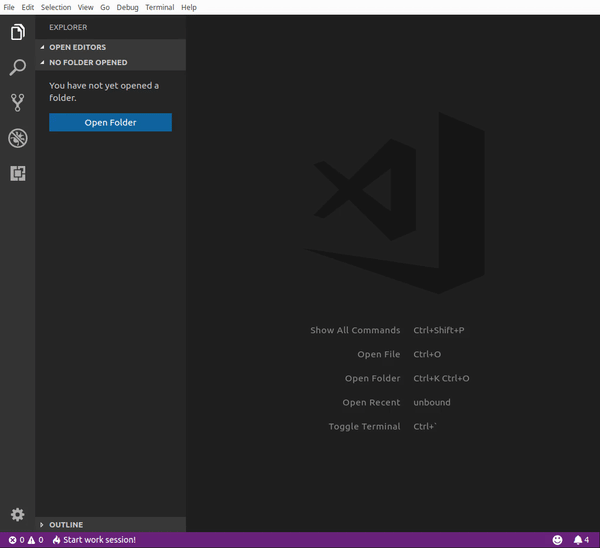

# Time Tracker

[](https://travis-ci.org/alexcambose/time-tracker) [](https://code.visualstudio.com/)

This extension allows you to easily track time, break reminders and more.



## Installation

Refer to Visual Studio Marketplace to install or download the extension

To install via command line, you should have installed `code` command in PATH

```
code --install-extension alexcambose.time-tracker
```

## Commands

- `Start work session`: start a work sesstion
- `Stop work session`: stop a work sesstion
- `Toggle Pause`: Start/Stop pause
- `Toggle Break`: Start/Stop break
- `Calculate salary`: Displays how much money you made during the last work session
- `Reset data`: Erases all data

## Features

- Start/Stop time tracking
- Pause
- Break
- Set break reminders
- Hourly salary calculator

## Extension Settings

- `time-tracker.shortTimeFormat`: short time format to display when working (see [formatting](https://momentjs.com/docs/#/displaying/format/))
- `time-tracker.longTimeFormat`: long time format to display in notifications or when paused (see [formatting](https://momentjs.com/docs/#/displaying/format/))
- `time-tracker.hourlyRate`: the amount of money earned for every hour worked. (formatting `<number> <currency>`, ex: `10 USD`, `16 EUR`)
- `time-tracker.breakInterval`: the time interval, in minutes, at which the extension will remind you to take break. Set it to 0 to disable.
- `time-tracker.saveWorkSessionBetweenStartups`: save work session between startups. If unchecked, the current work session will be ended when the editor closes.

<!-- ## Known Issues

Calling out known issues can help limit users opening duplicate issues against your extension. -->

## Release Notes

### 1.0.1

Fixed the time counter interval

### 1.0.0

First stable release of _Time Tracker_

### 0.0.1

Initial release of _Time Tracker_

---

**Enjoy!**
